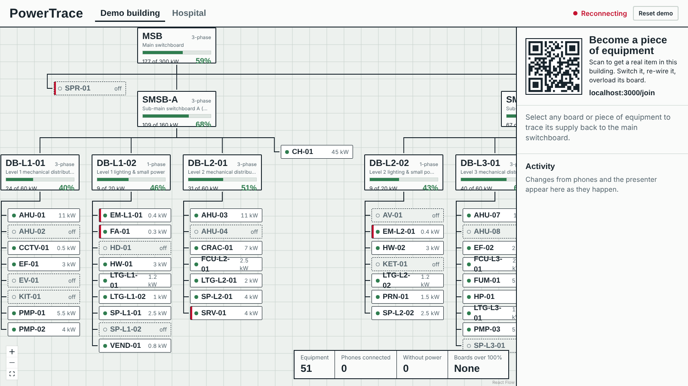
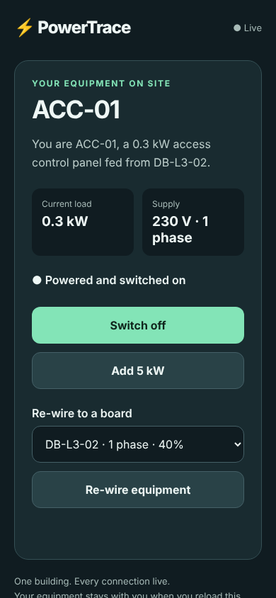
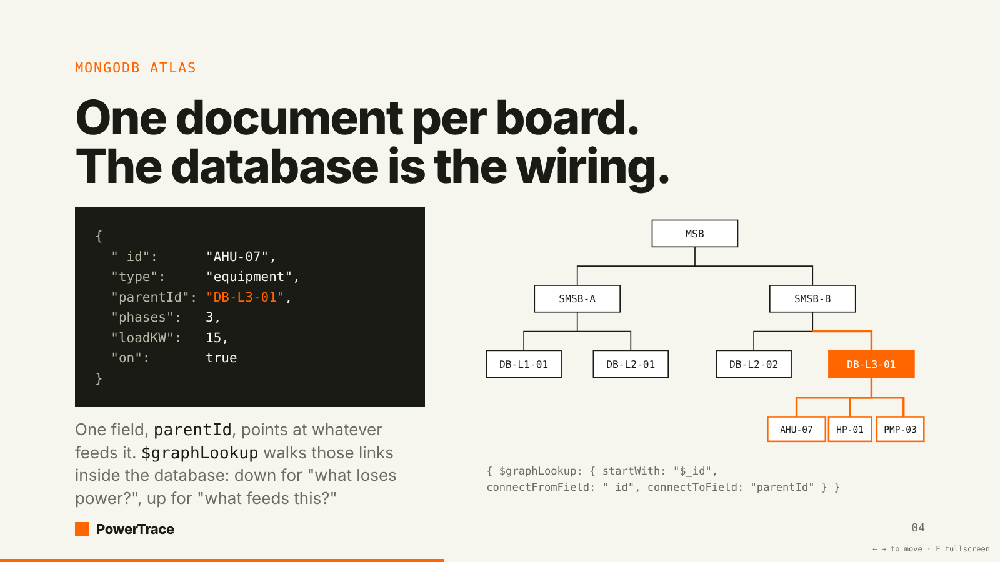

# PowerTrace

**A live dependency graph of a building's electrical system, stored in MongoDB Atlas.**
Ask "what does this panel feed?" or "what loses power if it trips?" and get the answer instantly, from the database, not from five spreadsheets.

Built at the MongoDB × Give(a)Go Student Builder Day, 3 October 2026.

**Live app:** [powertrace-embs.onrender.com](https://powertrace-embs.onrender.com/) · [Join from a phone](https://powertrace-embs.onrender.com/join)

---

## The problem

Every building has a power distribution hierarchy. Power comes in at a **main switchboard**, splits into **sub-main boards**, then into **distribution boards** on each floor, then into **circuits**, and finally reaches **equipment**: air handlers, lighting, pumps, lifts.

On a construction project that hierarchy is documented in cable schedules, panel schedules, single-line diagrams, spreadsheets and PDFs, often maintained by different contractors. So a basic question like *"what does DB-L3-01 actually feed?"* means cross-referencing several documents by hand. The reverse question, *"what feeds AHU-07?"*, is just as slow. And the documents drift from reality: equipment gets moved, circuits get re-terminated and loads get added on site, but the schedule doesn't always get updated.

That costs real money and creates real risk:

- **Shutdowns.** Before isolating a board for maintenance, someone has to know everything downstream. Miss one item and you switch off something that must stay on.
- **Overloads.** Loads get added piece by piece and nobody sees the running total on a board until it's a problem.
- **Handover.** The building owner inherits records that may not match what was built.

One of our team deals with this on construction projects every week. PowerTrace is the tool they wish they had.

## What PowerTrace does

Every board and every piece of equipment is one document in a single `nodes` collection, pointing at whatever feeds it through `parentId`. That one field turns a pile of documents into a graph MongoDB can walk.

| Feature | What you see |
| --- | --- |
| **Downstream trace** | "What loses power if this board trips?" Everything below it turns red. |
| **Upstream trace** | "What feeds AHU-07?" The path back to the main switchboard lights up. |
| **Live load per board** | The sum of every switched-on item downstream, as a % of the board's capacity. Amber at 80%, red over 100%. |
| **Validation** | Malformed equipment is rejected by the database. Moves that would create a circular feed, put 3-phase equipment on a single-phase board, or overload a board are rejected by the app. |
| **Live updates** | Every change appears on every screen within a second. |
| **Cable schedule import** | Load a messy CSV and get a report of which rows were rejected and why. |
| **Shutdown impact report** | Pick a board and get everything affected, with critical loads (theatre lighting, emergency lighting) flagged. |
| **Change history** | Who changed what, where and when, from the audit log. |

It runs on two buildings with the **same data model and the same queries**: a 60-item office building that a room full of people can rewire live from their phones, and a synthetic 12-storey hospital with ~300 boards and ~4,000 pieces of equipment.

## Why MongoDB is the engine

| MongoDB feature | Job it does |
| --- | --- |
| `$graphLookup` | Recursive downstream and upstream tracing, inside the database, not in our code |
| Aggregation pipelines | Live load % per board, the shutdown impact report, change history by level and day |
| Change streams | Every change on any phone is pushed to every screen |
| Schema validation (`$jsonSchema`) | Rejects equipment with a missing rating, an invalid voltage or an unknown type |
| Unique index | The equipment tag is the `_id`, so duplicate tags are rejected on import |
| Index on `parentId` | Keeps graph traversal fast at 4,000+ nodes (measured with `explain()`) |

`$jsonSchema` validates the shape of one document. Rules that span documents, like "no circular feeds" or "don't overload this board", are application logic built on `$graphLookup`.

The two queries everything is built on:

```js
// Downstream: what loses power if SMSB-B trips?
db.nodes.aggregate([
  { $match: { _id: "SMSB-B" } },
  { $graphLookup: { from: "nodes", startWith: "$_id",
      connectFromField: "_id", connectToField: "parentId",
      as: "downstream", depthField: "depth" } }
])

// Upstream: what feeds AHU-07?
db.nodes.aggregate([
  { $match: { _id: "AHU-07" } },
  { $graphLookup: { from: "nodes", startWith: "$parentId",
      connectFromField: "parentId", connectToField: "_id",
      as: "feedPath", depthField: "depth" } }
])
```

## The live demo

The room becomes the building site. A QR code on the main screen opens the phone page, and **every phone
becomes one real piece of equipment** in the demo building: a document in the `nodes` collection, such as
`AHU-07`, a 15 kW air handling unit fed from board `DB-L3-01`.

| Beat | What the room sees | What MongoDB does |
| --- | --- | --- |
| Switch on, add 5 kW | Load bars move on every screen within a second | A write to `nodes`; the change stream pushes it out; one aggregation recomputes every board's load |
| Pile on | `DB-L3-01` goes amber, then red: OVERLOAD | `$graphLookup` downstream + `$sum` of switched-on load, stopping at tripped boards |
| Bad re-wire | 3-phase kit onto a single-phase board is rejected on the phone that tried it | App validation on `$graphLookup` (circular feed, phase, overload upstream) |
| Trip `SMSB-B` | Half the room's phones flash **YOU'VE LOST POWER** | `$graphLookup` finds everything downstream of the tripped board |
| Trace | Tap any item: the feed path back to the main switchboard lights up | `$graphLookup` upstream |
| Hospital | A 4,257-node, 12-storey hospital: shutdown impact report with critical loads flagged, a messy 4,269-row cable schedule import with 24 rows rejected | The same queries at scale; `explain()` supplies the query time on screen |





## What is real

- **The system is real.** A live MongoDB Atlas database; every trace, load figure, rejection and trip you see is a query or a write against it, and every screen reads it back through change streams. Nothing on the screen is animated by hand.
- **Every node stands for a real thing.** One document is one physical board or one piece of equipment, linked to whatever feeds it, exactly as in a cable schedule.
- **The buildings are modelled.** Real cable schedules are confidential (and a hospital's power layout is security-sensitive), so the 60-node office and the 12-storey hospital are generated to match how real ones are laid out. The import accepts the columns of a real cable schedule, so pointing PowerTrace at a real building means importing its schedule; nothing else changes.

## Presentation

The 3-minute deck lives in [`/pitch`](pitch/index.html) and is served by the backend at **`/pitch`**, so its
QR code always points at the same server's `/join`. Arrow keys move, `F` goes fullscreen.



## Architecture

```text
 Phones (/join) <--actions / alerts--> Backend --writes--> MongoDB Atlas
 Fallback bot -----------actions-----> (Express  <--change stream--  (nodes, events,
                                        + Socket.IO)                  $graphLookup,
                                            |                         validation)
                                        Socket.IO
                                            v
                                       Main screen (tree, load bars, activity feed)
```

Phones and the bot send actions to the backend, which validates them and writes to Atlas. A change stream on `nodes` tells the backend what changed, and Socket.IO pushes it to the main screen and back to the phones.

**Stack:** Node, Express, Socket.IO and the official `mongodb` driver; React, Vite, React Flow and dagre for the main screen; one plain HTML page for phones; MongoDB Atlas.

## Data model

```json
{ "_id": "AHU-07", "type": "equipment", "kind": "AHU", "name": "Air handling unit",
  "parentId": "DB-L3-01", "level": 3, "voltage": 400, "phases": 3,
  "ratedKW": 15, "loadKW": 15, "on": true, "critical": false, "claimedBy": null }

{ "_id": "DB-L3-01", "type": "board", "kind": "DB", "name": "Level 3 mechanical distribution board",
  "parentId": "SMSB-B", "level": 3, "voltage": 400, "phases": 3, "capacityKW": 60, "tripped": false }
```

A second collection, `events`, logs every change (who, what, from, to, when). The full API and event contract is in [CONTRACT.md](CONTRACT.md).

## Repository layout

| Folder | What's in it |
| --- | --- |
| [`/backend`](backend) | Express + Socket.IO API, `$graphLookup` and load aggregations, validation, change streams, import and impact endpoints |
| [`/screen`](screen) | Main screen: React Flow building tree, load bars, activity feed, hospital view and impact panel |
| [`/join`](join) | The phone page (no app install, no build step) |
| [`/bot`](bot) | Simulated contractors for load testing and as a demo fallback; QR code printer |
| [`/data`](data) | Demo building, 4,000-item hospital generator, messy cable schedule CSV, seed scripts |
| [`/pitch`](pitch) | The 3-minute deck, served at `/pitch` |
| [`/mock`](mock) | In-memory implementation of the contract, so the frontends can be built before the real backend is live |
| [`CONTRACT.md`](CONTRACT.md) | The API, data model and Socket.IO events every part builds against |

## Getting started

Requires Node 20+ and a MongoDB Atlas cluster (the free M0 tier is enough; change streams work on it).

```bash
# 1. Configure
cp .env.example .env          # then paste your Atlas connection string into MONGODB_URI

# 2. Install every package
npm run install:all

# 3. Load data into Atlas
npm run seed:demo             # 60-node demo building
npm run seed:hospital         # ~4,300-node hospital + a week of change history

# 4. Run
npm run backend               # API + Socket.IO + phone page on http://localhost:3000 (/join)
npm run screen                # main screen on http://localhost:5173

# No Atlas yet? Run the in-memory mock of the API instead of the backend:
npm run mock

# Simulate 30 contractors
npm run bot
```

To let phones join from outside your laptop, expose port 3000 with a tunnel (for example `cloudflared tunnel --url http://localhost:3000`) and print a QR code with `npm run qr -- https://<your-tunnel-url>/join`.

### See everything on one laptop

```bash
npm run build:screen          # build the main screen once
npm run backend               # (or npm run mock without Atlas)
```

Then open `http://localhost:3000/` (main screen, press F11 for full screen), `http://localhost:3000/join`
(a phone, open several tabs) and `http://localhost:3000/pitch` (the deck; with the mock, open `pitch/index.html` directly, without the live QR).

## Deploying

MongoDB Atlas stores the data; the Node server (Express + Socket.IO + the change stream) needs a host that keeps
a process running, so it is deployed to [Render](https://render.com) as one web service (`render.yaml`).
That one service serves the main screen at `/`, the phone page at `/join`, the API at `/api` and Socket.IO.

1. Render → New → Blueprint → pick this repo. It reads `render.yaml` (`npm run build`, then `npm start`).
2. In the service's Environment tab set `MONGODB_URI` (Atlas → Network Access must allow `0.0.0.0/0`, as Render has no fixed IPs).
3. `USE_MOCK=1` runs the in-memory mock instead of the backend (no database needed); set it to `0` once the backend is live.

Serverless hosts such as Vercel can't hold the WebSocket connections and change stream open, so they are not used.

## Team

| Who | Built |
| --- | --- |
| Fortune | Lead: repo, contract, synthetic data, integration, the problem itself |
| Arush | Main screen |
| Alex | Phone page, bot, QR and tunnel, README and video |
| Matthew | Backend and everything MongoDB |
